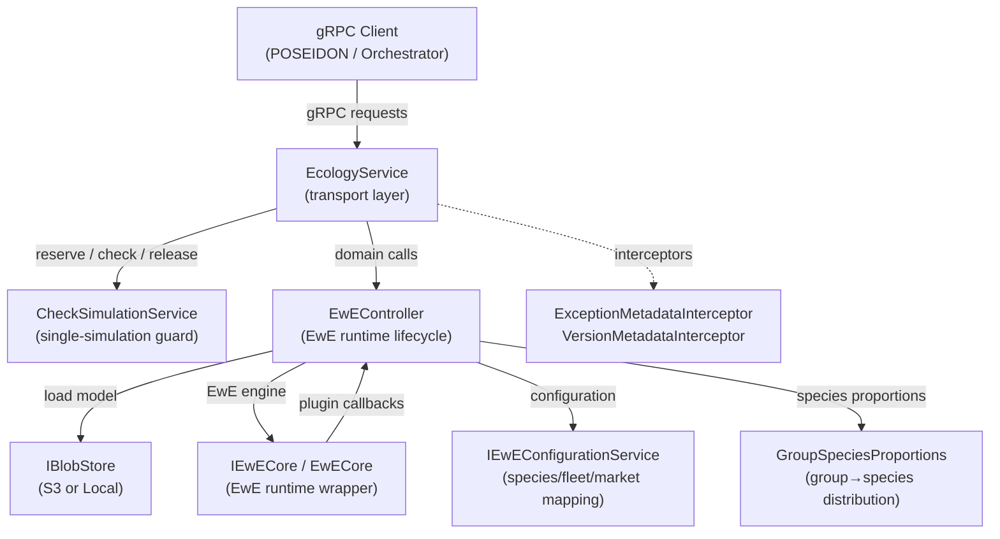
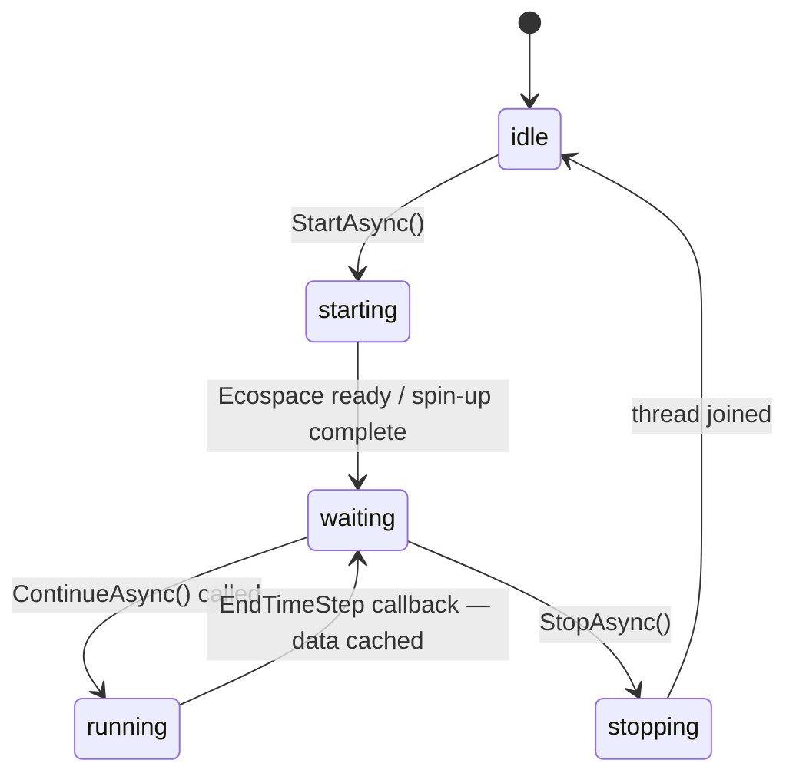
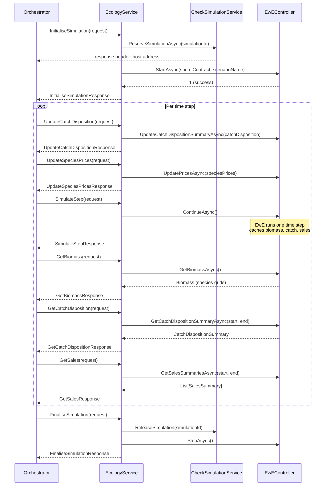

# EcologyService — Architecture

## Overview

`EcologyService` is the gRPC transport layer of **SURIMI-Ecopath**, a .NET 10 microservice that wraps the EwE (Ecopath with Ecosim/Ecospace) marine ecosystem modelling engine. It is one of several ecological-model components in the **SURIMI** (Simulation of Unregulated and Regulated Marine Interactions) Management Strategy Evaluation framework. All communication with other SURIMI components — such as POSEIDON (the fishing-fleet model) and the SURIMI Orchestrator — takes place over **gRPC**, using a shared protocol contract maintained externally in the `SURIMI-protocol` Buf repository.

---

## Responsibilities

- Expose the EwE Ecopath/Ecosim/Ecospace engine as a gRPC service to the SURIMI framework.
- Enforce single-simulation reservation: only one simulation may run at a time in a process instance.
- Translate between gRPC Protobuf message types and the internal `SURIMI.Datamodel` and EwE domain objects.
- Delegate all EwE business logic (start, step, stop, data retrieval) to `EwEController`.
- Write the chosen host address back to the gRPC caller as response metadata upon simulation reservation.
- Report protocol version to callers via `GetProtocolVersion`.

---

## Interfaces

### gRPC messages consumed (requests)

| RPC | Description |
|-----|-------------|
| `InitialiseSimulation` | Starts a new simulation run; carries the full `SurimiContract` (scenario geometry, species, fleet segments, markets, standards). |
| `FinaliseSimulation` | Gracefully ends the active simulation. |
| `CancelSimulation` | Aborts the active simulation. |
| `SimulateStep` | Advances the model by one time step. |
| `UpdateCatchDisposition` | Injects externally computed catch (gross catch, live/dead discards per cell) into EwE for the current time step. |
| `UpdateEnvironmentVariables` | Provides spatial environmental forcing fields (e.g. temperature, salinity) per cell. |
| `UpdateRegulations` | Delivers Total Allowable Catch (TAC) rules per fleet/species combination. |
| `UpdateSpeciesPrices` | Pushes market prices per species, category, market, and currency. |
| `GetBiomass` | Requests spatial biomass grids (kg per cell) for all mapped species. |
| `GetCatchDisposition` | Requests spatial catch summaries over a time window. |
| `GetFishingActivity` | Requests fishing activity ratios per fleet segment. |
| `GetSales` | Requests market sales (quantity and value) over a time window. |
| `GetProtocolVersion` | Requests the currently implemented SURIMI protocol version. |

### gRPC messages produced (responses)

Each RPC returns a corresponding `*Response` message that echoes the `SimulationId`, optional timestamps, and the requested data payload (biomass grids, catch disposition summaries, sales, etc.).

---

## Model theory

### Ecopath with Ecosim and Ecospace (EwE)
EwE is a widely used marine ecosystem modelling framework. It consists of three tightly coupled modules:
- **Ecopath** — a static, mass-balance snapshot of the ecosystem, defining biomass, production, consumption, and diet for all functional groups and fleets.
- **Ecosim** — a time-dynamic module that simulates changes in biomass over time using foraging arena theory.
- **Ecospace** — a spatially explicit extension of Ecosim that distributes biomass and fishing effort across a raster grid.

### Management Strategy Evaluation (MSE)
SURIMI-Ecopath participates in an MSE loop in which:
1. A fishing-fleet model (POSEIDON) allocates fishing effort and computes catch dispositions.
2. EcologyService ingests those catch dispositions and advances the ecosystem state by one time step.
3. Resulting biomass, catch, and sales data are read back by the orchestrator and fed into the next MSE iteration.

### Functional-group to species mapping
EwE operates on functional groups, not individual species. `GroupSpeciesProportions` distributes external species-level fishing across EwE groups, and maps EwE group-level output back to species-level biomass for SURIMI.

### One-based indexing
EwE data structures use one-based indexing for groups, fleets, rows, and columns throughout the codebase.

### Spatial cell centroids
Spatial outputs use cell centroids: `RowToLat(ir + 0.5)` and `ColToLon(ic + 0.5)` to convert grid indices to geographic coordinates.

### Unit conversion
Biomass values cross a unit boundary between SURIMI DTOs (kg) and EwE arrays (t/km²). `DensityToKg` and `KgToDensity` are the canonical conversion helpers.

---

## Service architecture

### High-Level Architecture

The service follows a strict two-layer design: `EcologyService` handles only transport mapping and input validation, while `EwEController` owns all EwE state and lifecycle.



### Ecospace stepping — RunState machine

`EwEController` coordinates the Ecospace run loop using a five-state machine. Ecospace runs on a dedicated background thread; gRPC calls interact with it through the pause/resume handshake.



The pause/resume handshake works as follows:
- Ecospace pauses at the **beginning** of each time step (`waiting` state).
- The orchestrator calls `UpdateCatchDisposition` and then `SimulateStep`.
- `ContinueAsync` releases the pause; EwE integrates prices at `BeginTimeStep`, injects external catch at `EffortDistrPost`, and caches biomass/catch/sales at `EndTimeStep`.
- The controller transitions back to `waiting` for the next step.

### Message flow



### Key design decisions / trade-offs

| Decision | Rationale |
|----------|-----------|
| Single-simulation reservation per process | EwE is a stateful, non-thread-safe engine. `CheckSimulationService` prevents concurrent simulations and makes the active host discoverable via response metadata, allowing an orchestrator to pin traffic to the correct pod. |
| gRPC contract stored externally (BSR / Buf) | Protobuf schema changes are managed centrally in `SURIMI-protocol` and published via the Buf Schema Registry, so no `.proto` files live in this repository. |
| EwE runs on a dedicated thread | Ecospace's internal event loop blocks; running it on a dedicated thread allows the gRPC thread pool to remain responsive while the pause/resume mechanism synchronises steps. |
| Functional-group proxy for species-level fishing | EwE does not natively support species-level fishing; `GroupSpeciesProportions` maintains per-cell proportions so the service can accept and return species-level data. |
| Empty cells filtered from responses | Biomass, catch, and sales responses omit cells with all-zero values to reduce payload size. |
| Country-code hack in `GetSales` | A hard-coded `ES`→`ESP` / `FRA` mapping is present as a known temporary workaround for the northwestern Mediterranean scenario. |

---

## Error handling

- Input validation is performed with `GrpcValidation.ArgumentNotNullOrEmpty` before any processing; invalid inputs throw an `RpcException` with `StatusCode.InvalidArgument`.
- If `EwEController.StartAsync` returns a non-1 result, an `RpcException` with `StatusCode.Internal` is thrown and the simulation reservation is released.
- All exceptions thrown inside `InitialiseSimulation` release the simulation reservation via `CheckSimulationService.ReleaseSimulation` before re-throwing, to prevent the service from becoming permanently locked.
- The `ExceptionMetadataInterceptor` (registered globally on the gRPC pipeline) catches unhandled exceptions and enriches the gRPC error response with structured metadata.
- Vault secret loading errors are caught and logged but do not prevent the service from starting.

---

## Logging

- Logging is configured at startup in `Program.cs` using `Microsoft.Extensions.Logging`.
- The console formatter is set to `systemd` style (structured, single-line with timestamp prefix `HH:mm:ss`).
- The `Logging` section of `appsettings.json` can override log levels per category.
- EwE internal sources that are not DI-injected obtain a logger via the static `LoggingContext.LoggerFactory`.
- All environment variables are logged at `Information` level during startup to aid debugging in containerised environments.
- Each gRPC method logs at `Information` level when it begins processing.

---

## S3 bucket

The service reads and writes the following file types through `IBlobStore`:

| Path | Content |
|------|---------|
| `ecopath/<scenario>.eiixml` | EwE model file (Ecopath/Ecosim/Ecospace scenario). |
| `ecopath/<scenario>.semantics` | Species/fleet/market semantic mapping file. |
| `ecopath/Output/` | Ecospace output files (written when `WriteOutput = true`). |

Locally the `Includes/` directory serves as the input root and `Output/` as the output root.

### S3 bucket authentication

When the environment variable `AWS_ACCESS_KEY_ID` is present at startup, the service creates an `S3BlobStore` using the following variables:

| Variable | Purpose |
|----------|---------|
| `AWS_S3_ENDPOINT` | S3-compatible endpoint URL (e.g. MinIO or AWS). |
| `AWS_ACCESS_KEY_ID` | Access key ID. |
| `AWS_SECRET_ACCESS_KEY` | Secret access key. |
| `AWS_BUCKET_NAME` | Target bucket name. |

When `AWS_ACCESS_KEY_ID` is absent, a `LocalBlobStore` rooted at `Includes/` and `Output/` is used instead (development / local mode).

---

## Kubernetes

SURIMI-Ecopath is designed to run as a pod in the **EDITO Datalab** Kubernetes cluster. Each pod instance handles at most one active simulation at a time (enforced by `CheckSimulationService`). The `CheckSimulationService` writes the pod's own host address back as gRPC response metadata (`host` header) at `InitialiseSimulation`, so the SURIMI Orchestrator can pin all subsequent calls for that simulation to the same pod (session affinity).

The service listens on port **7890** (configured via `ASPNETCORE_HTTP_PORTS`).

---

## Environment variables

| Variable | Required | Purpose |
|----------|----------|---------|
| `AWS_ACCESS_KEY_ID` | No | Enables S3 blob store; if absent, local filesystem is used. |
| `AWS_SECRET_ACCESS_KEY` | If S3 | S3 secret access key. |
| `AWS_S3_ENDPOINT` | If S3 | S3-compatible endpoint URL. |
| `AWS_BUCKET_NAME` | If S3 | S3 bucket name. |
| `ASPNETCORE_HTTP_PORTS` | No | gRPC listening port (default `7890`). |
| `OTEL_EXPORTER_OTLP_ENDPOINT` | No | OpenTelemetry collector endpoint for metrics/traces. |
| `OTEL_SERVICE_NAME` | No | Service name reported to OpenTelemetry (default `Ecopath`). |
| `VAULT_ADDR` | No | HashiCorp Vault server address for loading additional secrets. |
| `VAULT_TOKEN` | If Vault | Vault authentication token. |
| `VAULT_MOUNT` | If Vault | Vault KV mount point. |
| `VAULT_TOP_DIR` | If Vault | Top-level path prefix in Vault. |
| `VAULT_RELATIVE_PATH` | If Vault | Relative path within the Vault mount. |

When all five `VAULT_*` variables are set, secrets are loaded from Vault into environment variables at startup before the service begins accepting requests.

---

## CI/CD

### GitHub Actions

| Workflow | Trigger | What it does |
|----------|---------|--------------|
| **Build Check** (`.github/workflows/build-check.yml`) | Pull request to `master` | Runs `dotnet build` via the shared `Official-EwE/Eii.GithubActions/BuildCheckNet80` action to verify the solution compiles. Uses `BSR_TOKEN` from repository secrets to authenticate the Buf Schema Registry NuGet feed. |

### Docker image

The `Dockerfile` uses a multi-stage build:

1. **`build`** — Restores and builds the project using `mcr.microsoft.com/dotnet/sdk:10.0`. Private NuGet feeds (GitHub Packages and BSR) are authenticated using BuildKit `--secret` mounts, so tokens are never baked into the image layers.
2. **`publish`** — Runs `dotnet publish`.
3. **`final`** — Runtime image based on `mcr.microsoft.com/dotnet/aspnet:10.0` (Linux). An empty `Includes/` directory is created with correct ownership for the non-root application user.

The image is tagged as `ghcr.io/official-ewe/surimiecopath:latest` and pushed to the **GitHub Container Registry (GHCR)** under the `Official-EwE` organisation.

Build command:
```bash
docker build -f .\SURIMI-Ecopath\Dockerfile \
  --secret id=GITHUB_TOKEN,env=GITHUB_TOKEN \
  --secret id=BSR_TOKEN,env=BSR_TOKEN \
  -t ghcr.io/official-ewe/surimiecopath:latest .
```

---

## Technology stack

| Package | Role |
|---------|------|
| `BSR.Surimi.Surimi-Protocol.Grpc.Csharp` | Generated gRPC client/server stubs from the external `SURIMI-protocol` Buf repository. No local `.proto` files. |
| `Grpc.AspNetCore` | ASP.NET Core gRPC server hosting. |
| `Grpc.AspNetCore.Server.Reflection` | gRPC reflection endpoint for tooling (e.g. Postman, grpcurl). |
| `Eii.Ecopath.EwECore` | The EwE Ecopath/Ecosim/Ecospace engine (private GitHub Packages feed). |
| `Eii.Ecopath.Bridge` | Plugin bridge enabling callback interception at EwE time-step boundaries. |
| `Eii.BlobStore.S3` | S3-compatible blob store abstraction for reading/writing model and output files. |
| `Eii.ControlledVocabularies` | Controlled-vocabulary registries and `MultiLevelKey` matching for species, gear, country, and life-stage codes. |
| `Eii.SemanticRegistry` | Semantic mapping registry for binding EwE entities to SURIMI vocabulary terms. |
| `SURIMI.Common` | Shared gRPC utilities: `GrpcValidation`, `ExceptionMetadataInterceptor`, `VersionMetadataInterceptor`, `ProtocolVersionService`. |
| `SURIMI.Datamodel` | Shared SURIMI domain model DTOs (species, fleet segments, biomass grids, catch dispositions, etc.). |
| `VaultSharp` | HashiCorp Vault client for loading secrets into environment variables at startup. |
| `CsvHelper` | CSV parsing used for controlled-vocabulary data files in the `Includes/` directory. |
| `Google.Api.CommonProtos` | Google API common proto types (used by gRPC status handling). |

---

## Project structure

```
SURIMI-Ecopath/
├── SURIMI-Ecopath/                   # Main service project
│   ├── Program.cs                    # Host setup, DI registration, Vault loading
│   ├── Dockerfile                    # Multi-stage Docker build
│   ├── SURIMI-Ecopath.csproj
│   ├── Services/
│   │   ├── EcologyService.cs         # gRPC transport layer (this file)
│   │   └── CheckSimulationService.cs # Single-simulation reservation guard
│   ├── EwE/
│   │   ├── EwEController.cs          # EwE runtime lifecycle and step coordination
│   │   ├── EwEConfiguration.cs       # Model configuration (scenario, spin-up, output)
│   │   ├── EwEConfigurationService.cs# Loads configuration from blob store / semantics file
│   │   ├── GroupSpeciesProportions.cs          # Per-cell species proportions within a functional group
│   │   ├── GroupSpeciesProportionsFactory.cs   # Factory for building species-proportion mappings
│   │   └── Wrapper/
│   │       ├── IEwECore.cs / EwECore.cs         # Thin wrapper around EwE cCore for DI/testability
│   │       └── IPluginManager.cs / PluginManager.cs
│   └── Includes/                     # Local model files (.eiixml, .semantics)
├── SURIMI-Ecopath.Tests/             # xUnit test project
│   ├── EwE/
│   │   └── EwEControllerTests.cs
│   └── ~Checklist/
│       └── TestsChecklist.md
├── NuGet.config                      # Package source definitions (no secrets)
├── README.md
└── .github/
    └── workflows/
        └── build-check.yml           # CI build check on PRs to master
```

---

## Testing

### Automated tests

Tests live in `SURIMI-Ecopath.Tests` and use **xUnit** with **FluentAssertions**.

The test seam mocks the following interfaces to avoid requiring a real EwE engine:
- `IEwECore` — EwE engine wrapper
- `IEwEConfiguration` — model configuration
- `IPluginManager` — EwE plugin bridge
- `IKeyFieldDescriptorRegistry` — controlled-vocabulary descriptor registry
- `IBlobStore` — blob storage

Run the full test suite:
```bash
dotnet test .\SURIMI-Ecopath.sln --no-logo
```

Run a single test:
```bash
dotnet test .\SURIMI-Ecopath.Tests\SURIMI-Ecopath.Tests.csproj --no-logo `
  --filter "FullyQualifiedName~Ecopath.Tests.EwE.EwEControllerTests.GetBiomassAsync_ReturnsBiomass"
```

### Manual testing with Postman

Because `Grpc.AspNetCore.Server.Reflection` is registered, Postman (and `grpcurl`) can discover all available RPCs automatically from the running service without needing the `.proto` files locally. Point Postman at `http://localhost:7890` and use gRPC reflection to import the service definition.
