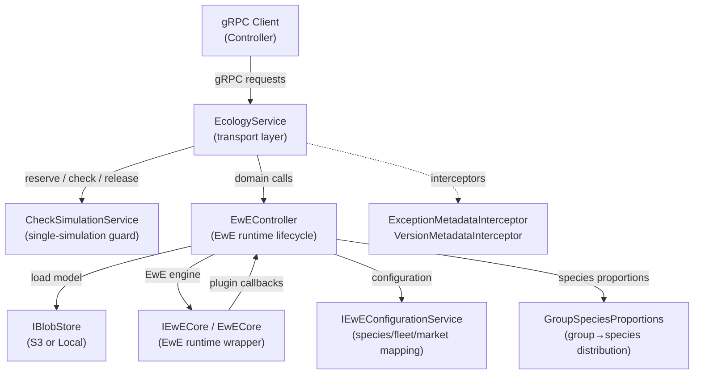
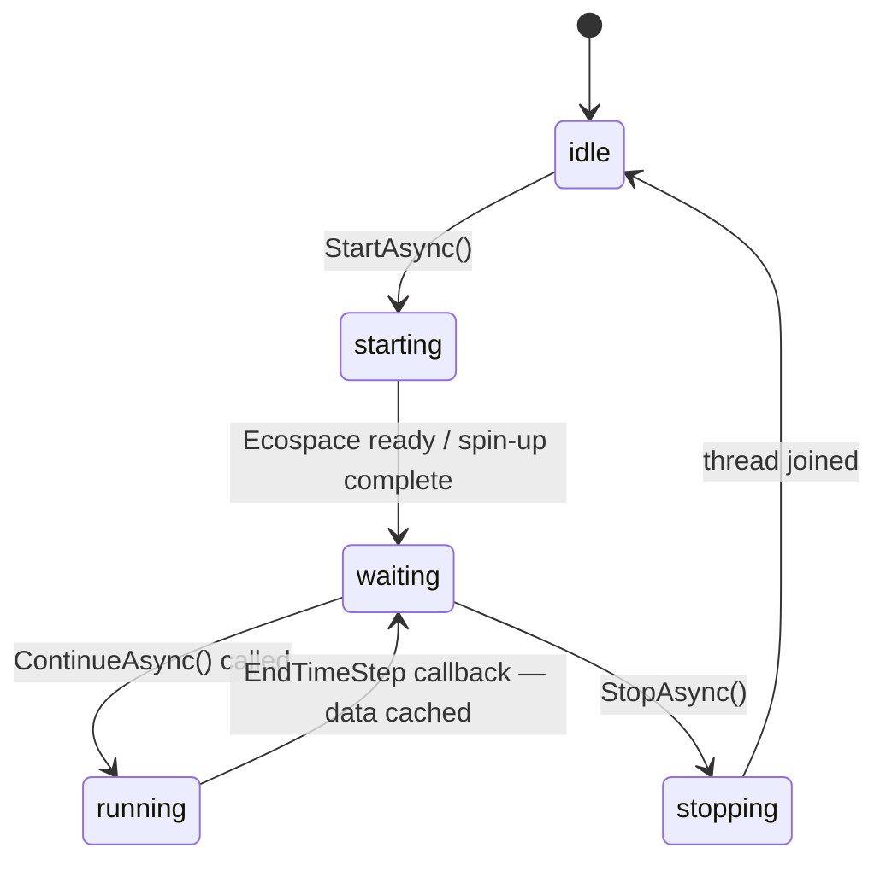
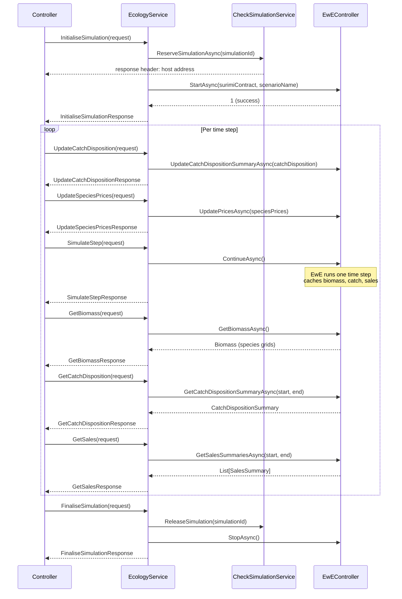

# Ecopath — Architecture

## Overview

**Ecopath** is the ecology model in the **SURIMI** multi-model simulation framework. It wraps the
[EwE (Ecopath with Ecosim / Ecospace)](https://ecopath.org) engine and exposes its functionality as
a gRPC service so that the **SURIMI Controller** can orchestrate it alongside other domain models.
All inter-model communication happens exclusively over gRPC; the Ecopath model never communicates
directly with other domain models.

The service is written in **C# (.NET 10)** and developed in **Microsoft Visual Studio Professional
2026**. It is hosted as an ASP.NET Core application and is designed to run in a Linux container.

### Licence

No licence file was found in this repository. Contact the repository owner
([Official-EwE](https://github.com/Official-EwE)) for licencing information.

---

## Responsibilities

- Load an EwE model file (`.eiixml`) from blob storage and initialise the Ecopath/Ecosim/Ecospace
  simulation chain.
- Run Ecospace time-step by time-step, synchronised with the SURIMI controller's clock.
- Accept external catch dispositions (fishing pressure computed by POSEIDON/other agents) and inject
  them into the EwE time step before EwE's own fishing occurs.
- Accept species prices from the market model and integrate them into the EwE market layer.
- Accept regulations (stub; not yet fully wired).
- Return spatially explicit biomass, catch disposition, and sales snapshots to the controller after
  each time step.
- Guard access with a single-simulation reservation so only one active simulation can run at a time
  per pod.

### Build outputs

| Binary | Description |
|---|---|
| `SURIMI-Ecopath.dll` | The main ASP.NET Core gRPC host; started as `dotnet SURIMI-Ecopath.dll` inside the Docker container. |

---

## Interfaces

The gRPC contract is defined in the external
[SURIMI-protocol](https://github.com/Official-EwE/SURIMI-protocol) repository (hosted on the
[Buf Schema Registry](https://buf.build/surimi/surimi-protocol)) and consumed as the NuGet package
`BSR.Surimi.Surimi-Protocol.Grpc.Csharp`. There are **no `.proto` files** in this repository.

### Lifecycle messages (call order matters)

| Direction | Message | Description |
|---|---|---|
| ← received | `InitialiseSimulation` | Reserves the pod, loads the model, runs Ecopath/Ecosim, starts Ecospace, and waits at the first simulation step. |
| ← received | `FinaliseSimulation` | Releases the reservation and stops the Ecospace thread cleanly. |
| ← received | `CancelSimulation` | Emergency stop; releases the reservation and forces Ecospace to stop. |

### Simulation-step messages

| Direction | Message | Description |
|---|---|---|
| ← received | `SimulateStep` | Advances Ecospace by one time step. |
| ← received | `UpdateCatchDisposition` | Delivers externally computed catch (gross catch, live/dead discards per species/fleet/cell) to be injected in the current step. |
| ← received | `UpdateSpeciesPrices` | Delivers species market prices for the current step. |
| ← received | `UpdateRegulations` | Delivers TAC regulations (stub). |
| → sent | `GetBiomass` | Returns spatially gridded biomass per species after the last completed step. |
| → sent | `GetCatchDisposition` | Returns spatially gridded catch (gross, live discards, dead discards) per species/fleet for the last step. |
| → sent | `GetSales` | Returns sales (quantity + value) per market for the last step. |
| → sent | `GetFishingActivity` | Returns fishing activity ratios per fleet segment (stub). |
| → sent | `GetProtocolVersion` | Returns the gRPC protocol version string. |

---

## Model theory

**Ecopath** is a static mass-balance food-web model that describes the biomass flows between
functional groups (species aggregates) in a marine ecosystem. **Ecosim** extends Ecopath into time,
simulating how the ecosystem evolves under fishing pressure and environmental forcing. **Ecospace**
adds a spatial dimension to Ecosim, distributing biomass over a regular grid and computing spatially
explicit movements and fishing.

The SURIMI integration relies on the **Ecospace pause/resume** mechanism: Ecospace halts at the
beginning of each time step, reports its state, receives externally computed catch dispositions from
the SURIMI controller (generated by agent-based fisheries models such as POSEIDON), injects those
dispositions back during the `EffortDistrPost` callback, and then runs the remainder of the time
step. This allows external agents to fish first; EwE fishes on the remainder. Time steps are assumed
to be monthly.

**Species-to-functional-group proportions** (`GroupSpeciesProportions`) are tracked per spatial cell
so that species-level external fishing can be distributed over EwE functional groups and
species-level biomass can be reconstructed from group-level EwE state.

---

## Service architecture

`Program.cs` wires the ASP.NET Core gRPC host, registers all services as singletons, and selects
the blob store implementation (S3 or local filesystem). `EcologyService` is the sole gRPC endpoint
class and acts purely as a transport adapter: it validates input, forwards calls to `EwEController`,
and maps between gRPC/SURIMI data model types. `EwEController` owns the EwE runtime lifecycle and
the pause/resume handshake, running Ecospace on a dedicated background thread and synchronising with
the ASP.NET thread via `TaskCompletionSource` events. `CheckSimulationService` enforces the
single-reservation contract and writes the pod host address back as gRPC response metadata. The
`IEwECore` and `IPluginManager` wrappers decouple the controller from concrete EwE runtime objects
to enable unit testing.

### High-Level Architecture

The service follows a strict two-layer design: `EcologyService` handles only transport mapping and input validation, while `EwEController` owns all EwE state and lifecycle.



### Ecospace stepping — RunState machine

`EwEController` coordinates the Ecospace run loop using a five-state machine. Ecospace runs on a dedicated background thread; gRPC calls interact with it through the pause/resume handshake.



The pause/resume handshake works as follows:
- Ecospace pauses at the **beginning** of each time step (`waiting` state).
- The controller calls `UpdateCatchDisposition` and then `SimulateStep`.
- `ContinueAsync` releases the pause; EwE integrates prices at `BeginTimeStep`, injects external catch at `EffortDistrPost`, and caches biomass/catch/sales at `EndTimeStep`.
- The controller transitions back to `waiting` for the next step.

### Message flow



### Key design decisions / trade-offs

| Decision | Rationale |
|----------|-----------|
| Single-simulation reservation per process | EwE is a stateful, non-thread-safe engine. `CheckSimulationService` prevents concurrent simulations and makes the active host discoverable via response metadata, allowing an orchestrator to pin traffic to the correct pod. |
| gRPC contract stored externally (BSR / Buf) | Protobuf schema changes are managed centrally in `SURIMI-protocol` and published via the Buf Schema Registry, so no `.proto` files live in this repository. |
| EwE runs on a dedicated thread | Ecospace's internal event loop blocks; running it on a dedicated thread allows the gRPC thread pool to remain responsive while the pause/resume mechanism synchronises steps. |
| Functional-group proxy for species-level fishing | EwE does not natively support species-level fishing; `GroupSpeciesProportions` maintains per-cell proportions so the service can accept and return species-level data. |
| Empty cells filtered from responses | Biomass, catch, and sales responses omit cells with all-zero values to reduce payload size. |
| Country-code hack in `GetSales` | A hard-coded `ES`→`ESP` / `FRA` mapping is present as a known temporary workaround for the northwestern Mediterranean scenario. |

---

## Error handling

- Input validation is performed with `GrpcValidation.ArgumentNotNullOrEmpty` before any processing; invalid inputs throw an `RpcException` with `StatusCode.InvalidArgument`.
- If `EwEController.StartAsync` returns a non-1 result, an `RpcException` with `StatusCode.Internal` is thrown and the simulation reservation is released.
- All exceptions thrown inside `InitialiseSimulation` release the simulation reservation via `CheckSimulationService.ReleaseSimulation` before re-throwing, to prevent the service from becoming permanently locked.
- The `ExceptionMetadataInterceptor` (registered globally on the gRPC pipeline) catches unhandled exceptions and enriches the gRPC error response with structured metadata.
- Vault secret loading errors are caught and logged but do not prevent the service from starting.

---

## Logging

- Logging is configured at startup in `Program.cs` using `Microsoft.Extensions.Logging`.
- The console formatter is set to `systemd` style (structured, single-line with timestamp prefix `HH:mm:ss`).
- The `Logging` section of `appsettings.json` can override log levels per category.
- EwE internal sources that are not DI-injected obtain a logger via the static `LoggingContext.LoggerFactory`.
- All environment variables are logged at `Information` level during startup to aid debugging in containerised environments.
- Each gRPC method logs at `Information` level when it begins processing.

---

## S3 bucket

The service reads and writes the following file types through `IBlobStore`:

| Path | Content |
|------|---------|
| `ecopath/<scenario>.eiixml` | EwE model file (Ecopath/Ecosim/Ecospace scenario). |
| `ecopath/<scenario>.semantics` | Species/fleet/market semantic mapping file. |
| `ecopath/Output/` | Ecospace output files (written when `WriteOutput = true`). |

Locally the `Includes/` directory serves as the input root and `Output/` as the output root.

### S3 bucket authentication

When the environment variable `AWS_ACCESS_KEY_ID` is present at startup, the service creates an `S3BlobStore` using the following variables:

| Variable | Purpose |
|----------|---------|
| `AWS_S3_ENDPOINT` | S3-compatible endpoint URL (e.g. MinIO or AWS). |
| `AWS_ACCESS_KEY_ID` | Access key ID. |
| `AWS_SECRET_ACCESS_KEY` | Secret access key. |
| `AWS_BUCKET_NAME` | Target bucket name. |

When `AWS_ACCESS_KEY_ID` is absent, a `LocalBlobStore` rooted at `Includes/` and `Output/` is used instead (development / local mode).

---

## Kubernetes

SURIMI-Ecopath is designed to run as a pod in the **EDITO Datalab** Kubernetes cluster. Each pod instance handles at most one active simulation at a time (enforced by `CheckSimulationService`). The `CheckSimulationService` writes the pod's own host address back as gRPC response metadata (`host` header) at `InitialiseSimulation`, so the SURIMI Controller can pin all subsequent calls for that simulation to the same pod (session affinity).

The service listens on port **7890** (configured via `ASPNETCORE_HTTP_PORTS`).

---

## Environment variables

| Variable | Required | Purpose |
|----------|----------|---------|
| `AWS_ACCESS_KEY_ID` | No | Enables S3 blob store; if absent, local filesystem is used. |
| `AWS_SECRET_ACCESS_KEY` | If S3 | S3 secret access key. |
| `AWS_S3_ENDPOINT` | If S3 | S3-compatible endpoint URL. |
| `AWS_BUCKET_NAME` | If S3 | S3 bucket name. |
| `ASPNETCORE_HTTP_PORTS` | No | gRPC listening port (default `7890`). |
| `OTEL_EXPORTER_OTLP_ENDPOINT` | No | OpenTelemetry collector endpoint for metrics/traces. |
| `OTEL_SERVICE_NAME` | No | Service name reported to OpenTelemetry (default `Ecopath`). |
| `VAULT_ADDR` | No | HashiCorp Vault server address for loading additional secrets. |
| `VAULT_TOKEN` | If Vault | Vault authentication token. |
| `VAULT_MOUNT` | If Vault | Vault KV mount point. |
| `VAULT_TOP_DIR` | If Vault | Top-level path prefix in Vault. |
| `VAULT_RELATIVE_PATH` | If Vault | Relative path within the Vault mount. |

When all five `VAULT_*` variables are set, secrets are loaded from Vault into environment variables at startup before the service begins accepting requests.

---

## CI/CD

### GitHub Actions

| Workflow | Trigger | What it does |
|----------|---------|--------------|
| **Build Check** (`.github/workflows/build-check.yml`) | Pull request to `master` | Runs `dotnet build` via the shared `Official-EwE/Eii.GithubActions/BuildCheckNet80` action to verify the solution compiles. Uses `BSR_TOKEN` from repository secrets to authenticate the Buf Schema Registry NuGet feed. |

### Docker image

The `Dockerfile` uses a multi-stage build:

1. **`build`** — Restores and builds the project using `mcr.microsoft.com/dotnet/sdk:10.0`. Private NuGet feeds (GitHub Packages and BSR) are authenticated using BuildKit `--secret` mounts, so tokens are never baked into the image layers.
2. **`publish`** — Runs `dotnet publish`.
3. **`final`** — Runtime image based on `mcr.microsoft.com/dotnet/aspnet:10.0` (Linux). An empty `Includes/` directory is created with correct ownership for the non-root application user.

The image is tagged as `ghcr.io/official-ewe/surimiecopath:latest` and pushed to the **GitHub Container Registry (GHCR)** under the `Official-EwE` organisation.

Build command:
```bash
docker build -f .\SURIMI-Ecopath\Dockerfile \
  --secret id=GITHUB_TOKEN,env=GITHUB_TOKEN \
  --secret id=BSR_TOKEN,env=BSR_TOKEN \
  -t ghcr.io/official-ewe/surimiecopath:latest .
```

---

## Technology stack

| Package | Role |
|---------|------|
| `BSR.Surimi.Surimi-Protocol.Grpc.Csharp` | Generated gRPC client/server stubs from the external `SURIMI-protocol` Buf repository. No local `.proto` files. |
| `Grpc.AspNetCore` | ASP.NET Core gRPC server hosting. |
| `Grpc.AspNetCore.Server.Reflection` | gRPC reflection endpoint for tooling (e.g. Postman, grpcurl). |
| `Eii.Ecopath.EwECore` | The EwE Ecopath/Ecosim/Ecospace engine (private GitHub Packages feed). |
| `Eii.Ecopath.Bridge` | Plugin bridge enabling callback interception at EwE time-step boundaries. |
| `Eii.BlobStore.S3` | S3-compatible blob store abstraction for reading/writing model and output files. |
| `Eii.ControlledVocabularies` | Controlled-vocabulary registries and `MultiLevelKey` matching for species, gear, country, and life-stage codes. |
| `Eii.SemanticRegistry` | Semantic mapping registry for binding EwE entities to SURIMI vocabulary terms. |
| `SURIMI.Common` | Shared gRPC utilities: `GrpcValidation`, `ExceptionMetadataInterceptor`, `VersionMetadataInterceptor`, `ProtocolVersionService`. |
| `SURIMI.Datamodel` | Shared SURIMI domain model DTOs (species, fleet segments, biomass grids, catch dispositions, etc.). |
| `VaultSharp` | HashiCorp Vault client for loading secrets into environment variables at startup. |
| `CsvHelper` | CSV parsing used for controlled-vocabulary data files in the `Includes/` directory. |
| `Google.Api.CommonProtos` | Google API common proto types (used by gRPC status handling). |

---

## Project structure

```
SURIMI-Ecopath/
├── SURIMI-Ecopath/                   # Main service project
│   ├── Program.cs                    # Host setup, DI registration, Vault loading
│   ├── Dockerfile                    # Multi-stage Docker build
│   ├── SURIMI-Ecopath.csproj
│   ├── Services/
│   │   ├── EcologyService.cs         # gRPC transport layer (this file)
│   │   └── CheckSimulationService.cs # Single-simulation reservation guard
│   ├── EwE/
│   │   ├── EwEController.cs          # EwE runtime lifecycle and step coordination
│   │   ├── EwEConfiguration.cs       # Model configuration (scenario, spin-up, output)
│   │   ├── EwEConfigurationService.cs# Loads configuration from blob store / semantics file
│   │   ├── GroupSpeciesProportions.cs          # Per-cell species proportions within a functional group
│   │   ├── GroupSpeciesProportionsFactory.cs   # Factory for building species-proportion mappings
│   │   └── Wrapper/
│   │       ├── IEwECore.cs / EwECore.cs         # Thin wrapper around EwE cCore for DI/testability
│   │       └── IPluginManager.cs / PluginManager.cs
│   └── Includes/                     # Local model files (.eiixml, .semantics)
├── SURIMI-Ecopath.Tests/             # xUnit test project
│   ├── EwE/
│   │   └── EwEControllerTests.cs
│   └── ~Checklist/
│       └── TestsChecklist.md
├── NuGet.config                      # Package source definitions (no secrets)
├── README.md
└── .github/
    └── workflows/
        └── build-check.yml           # CI build check on PRs to master
```

---

## Source control

Git is used for source control, hosted on **GitHub** at
[Official-EwE/SURIMI-Ecopath](https://github.com/Official-EwE/SURIMI-Ecopath). The default
integration branch is `master`. There are no Git submodules. The gRPC contract lives in a
**separate repository** ([SURIMI-protocol](https://github.com/Official-EwE/SURIMI-protocol)) and is
consumed as a versioned NuGet package from the Buf Schema Registry, so proto-file changes do not
require commits here — only a package version bump in the `.csproj`.

---

## Testing

### Automated tests

Tests live in `SURIMI-Ecopath.Tests` and use **xUnit** with **FluentAssertions**.

The test seam mocks the following interfaces to avoid requiring a real EwE engine:
- `IEwECore` — EwE engine wrapper
- `IEwEConfiguration` — model configuration
- `IPluginManager` — EwE plugin bridge
- `IKeyFieldDescriptorRegistry` — controlled-vocabulary descriptor registry
- `IBlobStore` — blob storage

Run the full test suite:
```bash
dotnet test .\SURIMI-Ecopath.sln --no-logo
```

Run a single test:
```bash
dotnet test .\SURIMI-Ecopath.Tests\SURIMI-Ecopath.Tests.csproj --no-logo `
  --filter "FullyQualifiedName~Ecopath.Tests.EwE.EwEControllerTests.GetBiomassAsync_ReturnsBiomass"
```

### Manual testing with Postman

Because `Grpc.AspNetCore.Server.Reflection` is registered, Postman (and `grpcurl`) can discover all available RPCs automatically from the running service without needing the `.proto` files locally. Point Postman at `http://localhost:7890` and use gRPC reflection to import the service definition.
